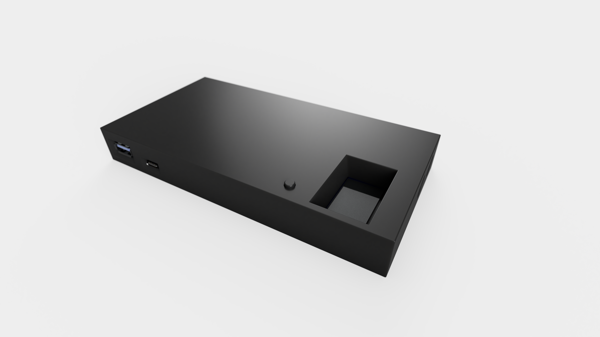
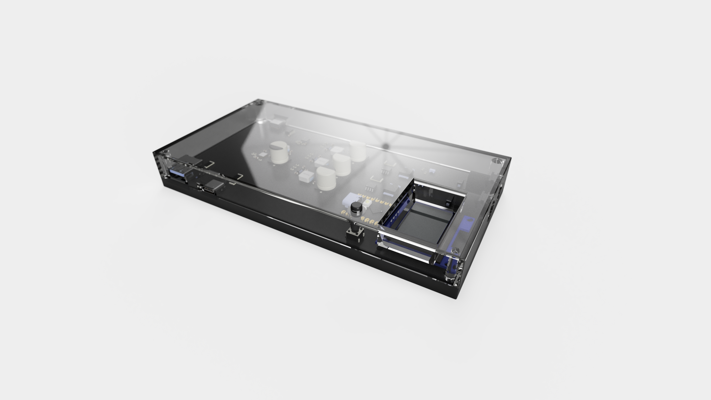
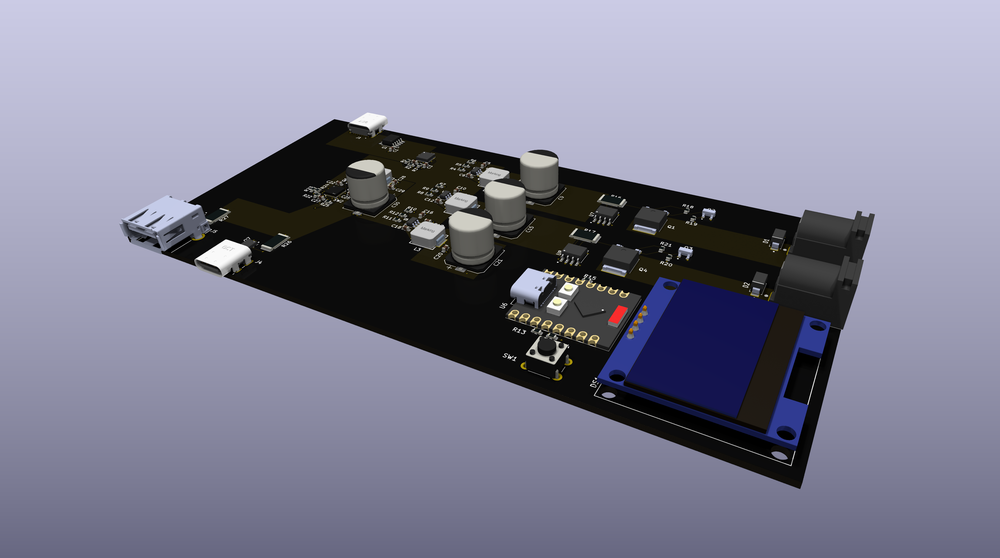
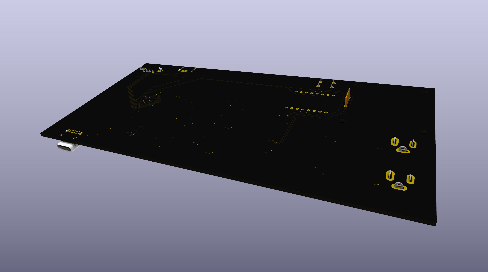
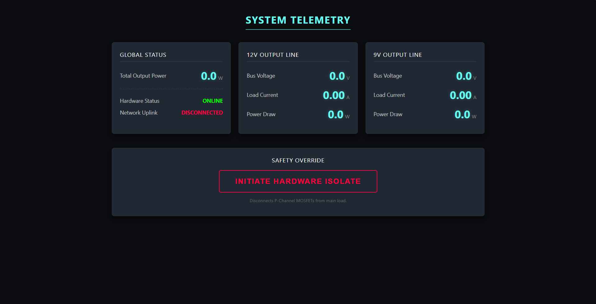

# 100W IoT Power Hub | ESP32-C3

A custom-engineered, dual-rail Power Delivery (PD) hub featuring hardware-level I2C telemetry, commercial DFM clamshell mechanics, and an asynchronous WebSocket control dashboard. 

---

## Mechanical Engineering (DFM)

The enclosure is architected for a friction-fit prototyping phase, scaling to ultrasonic welding for mass production.
* **Non-Collision Assembly:** Designed with strict vertical U-channels for all I/O ports, eliminating plastic undercuts and allowing seamless top-down Z-axis assembly.
* **Interference Tolerancing:** Utilizes a modeled `0.05mm` press-pull lip-and-groove parting line to achieve a reliable friction fit without failure-prone snap hooks.
* **Kinematic Trapping:** The PCB is cradled by lower bosses and secured by mirrored upper retaining posts featuring a `0.2mm` rattle gap to guarantee closure without crushing the FR4 fiberglass.
* **Captive Actuation:** Features a custom 15mm "long-stem mushroom" plunger mechanism with strict 0.2mm clearance tolerances for the tactile UI switch.

---

## Electrical Architecture

Designed in KiCad 7/8, the motherboard isolates high-power delivery protocols from sensitive RF and logic components.
* **Dual-Rail Telemetry:** Utilizes two Texas Instruments INA219 ICs (I2C) for independent, high-speed monitoring of both the 12V Main and 9V PD lines.
* **Hardware PD Negotiation:** Integrates the autonomous SW3516 buck-boost controller for dedicated Type-C PD 3.0 protocol handshakes, offloading thermal and negotiation logic from the MCU.
* **RF Isolation:** Antenna routing and component placement are optimized to prevent the ESP32-C3's 2.4GHz radio from introducing jitter into the analog-to-digital current sensing pathways.

---

## Embedded Firmware & IoT

The C++ backend operates on a strict, non-blocking deterministic state machine, ensuring network handling never interrupts safety-critical hardware isolation.
* **Asynchronous WebSockets:** The ESP32 hosts a continuous WebSocket tunnel, pushing serialized JSON packets to the frontend only when clients are actively connected, saving CPU cycles.
* **PROGMEM Decoupling:** All HTML, CSS, and JavaScript assets are decoupled into an external `dashboard.h` file and stored in flash memory, preserving SRAM for runtime telemetry.
* **Hardware-Agnostic Graphics:** Drives a 1.3" SH1106 OLED using the U8g2 memory buffer, pushing mathematical frame geometry in single I2C blasts to prevent screen tearing.
* **Zero-Blocking Safety:** The 20-millisecond overcurrent protection polling loop runs independently of the network stack; physical hardware isolation always overrides remote UI commands.

---

## Future Roadmap
* Implementation of `WiFiManager` (Captive Portal) for dynamic AP provisioning, removing hardcoded network credentials from the master branch.